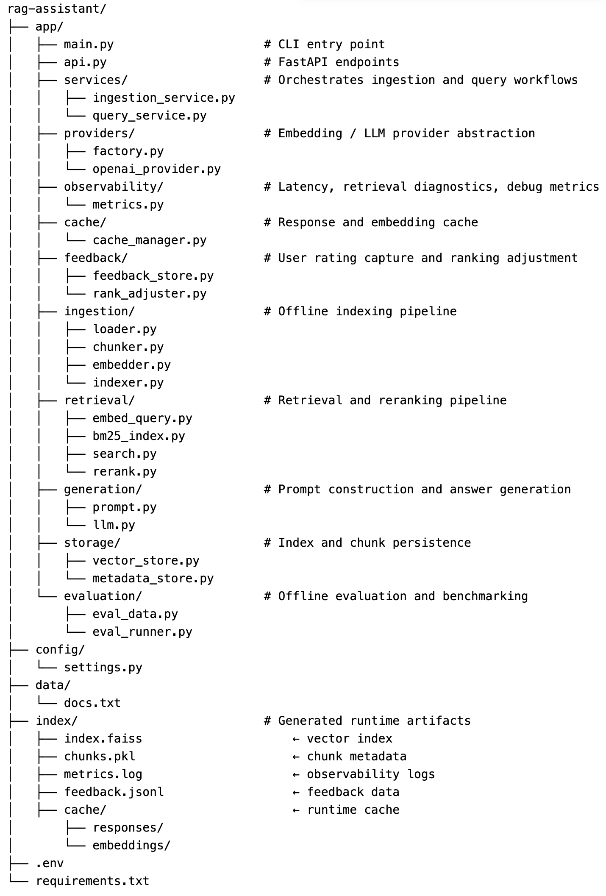

# RAG Assistant

A modular Retrieval-Augmented Generation (RAG) system designed to demonstrate system-level thinking across ingestion, retrieval, ranking, generation, observability, caching, and feedback loops.

This project focuses on architecture, tradeoffs, and system behavior, not just model integration.

## Overview

RAG Assistant ingests documents, builds a vector index, retrieves relevant chunks using hybrid search, and generates answers using an LLM.

Key capabilities:
- Hybrid retrieval (FAISS + BM25)
- Reranking for precision
- Observability (latency + retrieval diagnostics)
- Caching (response reuse)
- Feedback loop (user ratings influence ranking)



## Architecture

User Query → Embedding → Hybrid Retrieval → Reranking → Feedback Adjustment → Prompt → LLM → Response


## Features

### Hybrid Retrieval
- Vector search (FAISS)
- Keyword search (BM25)
- Combined candidate set

### Observability
- Latency tracking
- Retrieval diagnostics
- Debug output

### Caching
- Response-level caching
- Reduces latency and cost

### Feedback Loop
- Stores user ratings
- Adjusts ranking using feedback

## Setup

```bash
python3 -m venv .venv
source .venv/bin/activate
pip install -r requirements.txt
```

Create `.env`:

```
OPENAI_API_KEY=your_key_here
EMBEDDING_MODEL=text-embedding-3-small
EMBEDDING_PROVIDER=openai
```

## Run

CLI:
```bash
python -m app.main
```

API:
```bash
uvicorn app.api:app --reload
```

Docs:
http://127.0.0.1:8000/docs

## Endpoints

### /query
POST request:
```
{
  "question": "...",
  "include_debug": true
}
```

### /feedback
```
{
  "question": "...",
  "answer": "...",
  "sources": [...],
  "rating": 5
}
```

## Cache

Clear cache:
```bash
rm -rf index/cache/responses/*
```

## Feedback

Stored in:
```
index/feedback.jsonl
```

## Purpose

This project demonstrates:
- RAG system design
- Retrieval debugging
- Observability
- Feedback-driven improvements

## Author

Abhishek